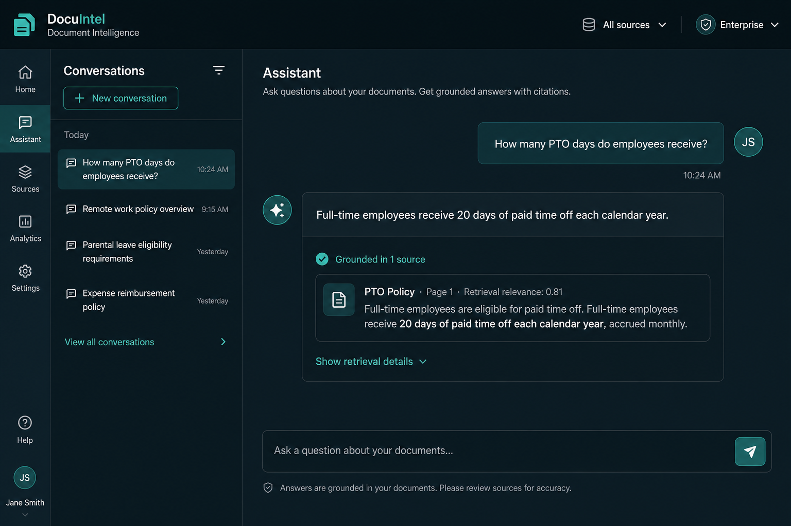
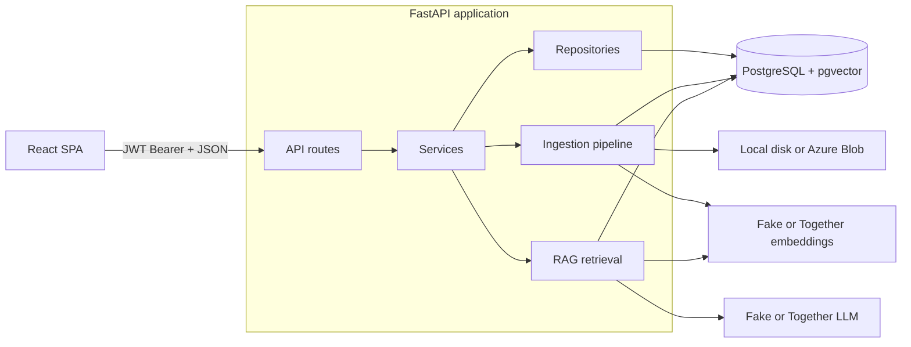
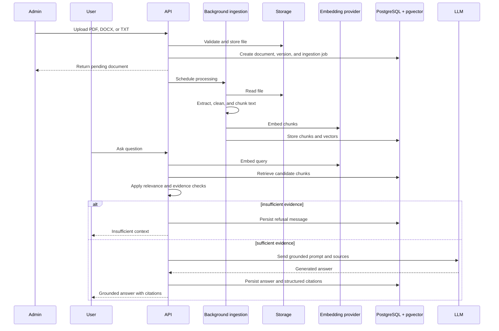

# Enterprise Document Intelligence Platform


A full-stack internal document platform that lets administrators upload company policies
and employees search or ask questions across them. Documents are extracted, chunked,
embedded, and indexed in PostgreSQL with pgvector. Answers are grounded in retrieved
content and include structured citations or an insufficient-context refusal.

> **Status:** Feature-complete local portfolio demo.  
> Fake providers run offline by default; Together.ai can be enabled for live embeddings and answers.



## Project highlights

- 25 REST API endpoints
- 9 relational database models
- 11 Alembic migrations
- 130 backend and frontend automated test cases
- PDF, DOCX, and TXT ingestion
- PostgreSQL pgvector retrieval with an HNSW cosine index
- JWT authentication with admin and employee roles
- Docker and GitHub Actions CI

## Core features

- Secure document upload, versioning, preview, deletion, and reprocessing
- PDF, DOCX, and TXT extraction with configurable chunking
- Semantic retrieval with PostgreSQL, pgvector, and an HNSW cosine index
- Grounded AI answers with structured citations and insufficient-context refusals
- JWT authentication and admin/employee role-based access control
- Persistent conversations with user ownership enforcement
- Admin analytics, audit logs, ingestion monitoring, and stale-job recovery
- Local and Azure Blob storage providers
- Health checks, readiness checks, request IDs, and structured logging
- Azure Blob storage adapter and documented Azure deployment path

## Architecture



### RAG workflow



Details: [architecture.md](docs/architecture.md) · [decisions.md](docs/decisions.md) · [rag.md](docs/rag.md)

## Technology stack

| Area | Technology |
|------|------------|
| Backend | Python 3.12, FastAPI, SQLAlchemy 2.x, Pydantic, Alembic |
| Database | PostgreSQL + pgvector (HNSW cosine) |
| Frontend | React 18, TypeScript, Vite, React Router |
| AI | Together.ai **or** deterministic `fake` providers |
| Quality | Ruff, MyPy, Pytest, ESLint, TypeScript, Vitest |
| Infra | Docker Compose, GitHub Actions |

## Quick start

```bash
cp backend/.env.example backend/.env
cp frontend/.env.example frontend/.env
docker compose up --build
```

| Service | URL |
|---------|-----|
| Frontend | http://localhost:5173 |
| API | http://localhost:8000 |
| OpenAPI | http://localhost:8000/docs |

### Local development

```bash
bash scripts/bootstrap.sh
docker compose up -d db
cd backend
python -m venv .venv
source .venv/bin/activate
pip install -e '.[dev]'
alembic upgrade head
uvicorn app.main:app --reload
```

In another terminal:

```bash
cd frontend
npm install
npm run dev
```

From the repository root, seed demo users with `make seed`:

| Role | Email | Password |
|------|-------|----------|
| Admin | `admin@example.com` | `admin123` |
| Employee | `employee@example.com` | `employee123` |

## Demo walkthrough

1. Sign in as **admin** and upload a file from `sample-documents/`.
2. Wait until processing status is **Completed**.
3. In **Assistant**, ask: *How many PTO days do employees receive?*
4. Confirm structured citations under the answer; try an unsupported question for a refusal.

The default fake providers require no API key and are intended for deterministic tests
and workflow demonstrations. They do not represent production retrieval or answer quality.

To use Together.ai, set `EMBEDDING_PROVIDER=together`, `LLM_PROVIDER=together`, and
`TOGETHER_API_KEY` in `backend/.env`, then reprocess documents after switching providers.

## Configuration

Important settings include the database URL, JWT secret, provider selection, storage
backend, CORS origins, frontend API URL, and RAG thresholds:

| Variable | Purpose |
|----------|---------|
| `RAG_TOP_K` / `RAG_MIN_RELEVANCE_SCORE` | Retrieval depth and minimum relevance |
| `RAG_MIN_SUPPORTING_CHUNKS` | Minimum supporting evidence required |
| `RAG_MIN_TERM_OVERLAP` | Lexical support requirement |
| `RAG_ANSWER_STYLE` | Answer-formatting preference |

Full list: [`backend/.env.example`](backend/.env.example) · [`frontend/.env.example`](frontend/.env.example).  
**Never commit real secrets.**

## API

The platform exposes 25 REST endpoints across authentication, documents, search,
conversations, administration, and system health.

- OpenAPI: `http://localhost:8000/docs`
- Examples: [docs/api-examples.md](docs/api-examples.md)

Uploads create an `IngestionJob` and process extraction → chunking → embedding → indexing
in a background task. See [docs/operations.md](docs/operations.md).

## Security

Implemented controls include bcrypt password hashing, JWT authentication, role-based
authorization, conversation ownership, upload type and magic-byte validation, rate
limiting, structured errors, CORS restrictions, audit logging, and production
configuration checks. See [docs/security.md](docs/security.md).

## Testing and CI

```bash
make test
make check
```

GitHub Actions runs lint, types, Alembic, Pytest (Postgres/pgvector), frontend checks,
and Docker image builds. See [docs/ci.md](docs/ci.md).

## Cloud / Azure

Local Compose is the default. Manual cloud path: [docs/azure.md](docs/azure.md),
[infra/azure/](infra/azure/README.md), [docker-compose.prod.example.yml](docker-compose.prod.example.yml).

Blob storage uses a real Azure adapter when `STORAGE_BACKEND=azure`. The current
implementation uses a connection string; production secret storage through Key Vault
and managed identity are documented follow-ups.

## Known limitations

- Ingestion runs through FastAPI `BackgroundTasks` inside the API process
- Rate limiting is stored in memory and is not shared across replicas
- Local disk is the default storage backend; Azure Blob is optional
- Documents are organization-wide and do not have per-document ACLs
- Authentication uses access tokens only; refresh tokens and SSO are not implemented
- Azure infrastructure is documented and sketched in Bicep but is not automatically deployed
- Grounding and evidence thresholds reduce unsupported answers but cannot eliminate hallucinations

## Documentation

| Doc | Contents |
|-----|----------|
| [architecture.md](docs/architecture.md) | Layers, RAG, jobs |
| [decisions.md](docs/decisions.md) | Design trade-offs |
| [security.md](docs/security.md) | Auth, uploads, audits |
| [operations.md](docs/operations.md) | Probes, logging, stale jobs |
| [api-examples.md](docs/api-examples.md) | curl recipes |
| [rag.md](docs/rag.md) | Thresholds and providers |
| [azure.md](docs/azure.md) | Cloud deployment plan |
| [ci.md](docs/ci.md) | CI quality gates |
| [sample-documents](sample-documents/README.md) | Demo policies |

## License

MIT — see [LICENSE](LICENSE).
