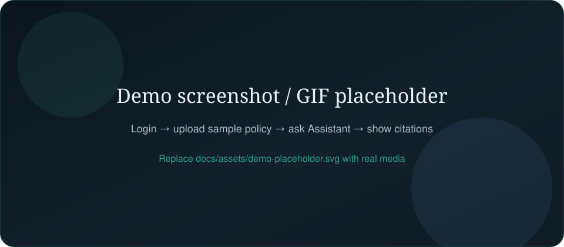
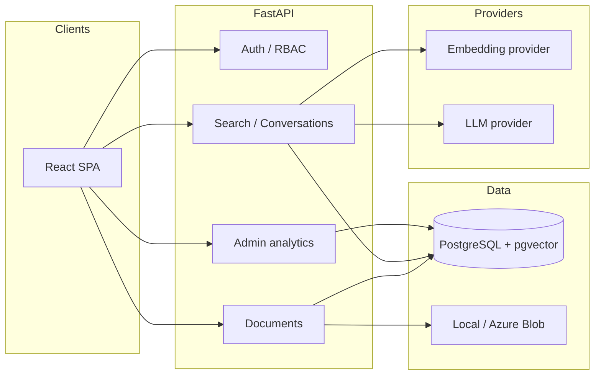
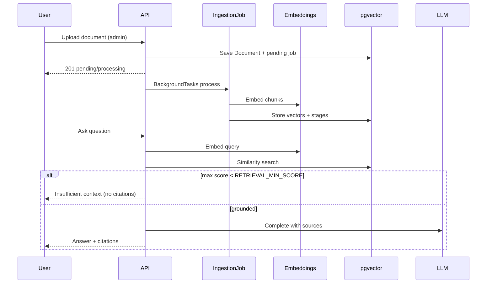

# Enterprise Knowledge Management Platform


Secure internal document management with traditional search and **grounded**
Retrieval-Augmented Generation (RAG)—built as a production-style portfolio full-stack app.

> **Status:** Feature-complete for local demo (auth → documents → ingestion → RAG → admin/ops).  
> Fake LLM/embeddings work out of the box; Together.ai is optional for live answers.



*Replace the placeholder with screenshots or a short GIF of login → upload → assistant citations.*

## Problem

Enterprises bury policies in shared drives. Employees ask the same questions; answers are
hard to find and easy to invent. This platform stores approved documents, indexes them for
keyword and vector search, and answers questions **only when retrieved context is strong
enough**—with citations back to source pages.

## What this project demonstrates

- Modular FastAPI backend (API → services → repositories)
- JWT auth + RBAC (admin vs employee)
- Document upload, versioning, and async ingestion jobs
- pgvector semantic retrieval + grounded chat with citations / refusals
- React admin + employee UI (documents, assistant, analytics, status)
- Observability: request IDs, JSON logs, readiness probes, admin metrics
- Azure-ready packaging and an explicit scale-out story for workers

## Architecture



### RAG workflow



More detail: [docs/architecture.md](docs/architecture.md) · [docs/decisions.md](docs/decisions.md)

## Technology stack

| Area | Technology |
|------|------------|
| Backend | Python 3.12, FastAPI, SQLAlchemy 2.x, Pydantic, Alembic |
| Database | PostgreSQL + pgvector (HNSW cosine) |
| Frontend | React 18, TypeScript, Vite, React Router |
| AI | Together.ai **or** deterministic `fake` providers |
| Quality | Ruff, MyPy, Pytest, ESLint, TypeScript, Vitest, `make check` |
| Infra | Docker Compose, GitHub Actions |

## Repository layout

```text
├── backend/              # FastAPI app, Alembic, tests
├── frontend/             # React SPA
├── sample-documents/     # Demo policies for upload / RAG demos
├── scripts/              # bootstrap, create_admin, seed_dev
├── docs/                 # architecture, security, ops, Azure, API examples
├── .github/workflows/    # CI
├── docker-compose.yml
└── Makefile
```

## Prerequisites

- Docker Desktop (or Engine + Compose) **or** local PostgreSQL 16+ with pgvector
- Python 3.12+
- Node.js 20+ (22 recommended)

## Quick start (Docker Compose)

```bash
cp backend/.env.example backend/.env
cp frontend/.env.example frontend/.env
docker compose up --build
```

| Service | URL |
|---------|-----|
| Frontend | http://localhost:5173 |
| API | http://localhost:8000 |
| OpenAPI | http://localhost:8000/docs |
| Health / Ready | `/health` · `/ready` |

The API container runs `alembic upgrade head` on startup.

## Local development

```bash
bash scripts/bootstrap.sh          # copies .env files
docker compose up -d db            # or use Homebrew Postgres + pgvector
make migrate                       # alembic upgrade head
# terminal 1
cd backend && source .venv/bin/activate && pip install -e '.[dev]'
make run
# terminal 2
cd frontend && npm install && npm run dev
make seed                          # admin + employee users
```

### Seed development users

```bash
make seed
# or: bash scripts/seed_dev.sh
```

| Role | Email | Password |
|------|-------|----------|
| Admin | `admin@example.com` | `admin123` |
| Employee | `employee@example.com` | `employee123` |

Custom admin only:

```bash
bash scripts/create_admin.sh you@example.com 'your-secure-password' 'Your Name'
```

## Demo walkthrough (RAG)

1. Sign in as **admin** (`admin@example.com` / `admin123`).
2. **Admin → Upload** one of `sample-documents/*.txt` (e.g. HR PTO policy).
3. Wait until status is **Completed** on Documents / detail (pipeline stages update live).
4. Open **Assistant** and ask: *How many PTO days do employees receive?*
5. Confirm the answer includes **citations** with document title and relevance score.
6. Try a nonsense question — expect an **insufficient context** refusal.

With fake providers, embeddings are deterministic local vectors (good for demos/tests).  
For live model quality:

```bash
# backend/.env
EMBEDDING_PROVIDER=together
LLM_PROVIDER=together
TOGETHER_API_KEY=...
```

## Fake vs real providers

| Setting | Behavior |
|---------|----------|
| `*_PROVIDER=fake` (default) | No network; stable tests and offline demos |
| `*_PROVIDER=together` | HTTP embeddings + chat; requires `TOGETHER_API_KEY` |
| `APP_ENV=test` | Forces fake-compatible behavior; ingestion runs inline |

Interfaces live under `backend/app/ingestion/embeddings/` and `backend/app/llm/`.

## Environment variables

Full list: [`backend/.env.example`](backend/.env.example) · [`frontend/.env.example`](frontend/.env.example)

| Variable | Purpose |
|----------|---------|
| `DATABASE_URL` | SQLAlchemy URL |
| `SECRET_KEY` | JWT signing (production-hardened) |
| `CORS_ORIGINS` | Browser origins |
| `EMBEDDING_PROVIDER` / `LLM_PROVIDER` | `fake` or `together` |
| `TOGETHER_API_KEY` | Required for Together providers |
| `RETRIEVAL_TOP_K` / `RETRIEVAL_MIN_SCORE` | RAG ranking / refusal gate |
| `STORAGE_BACKEND` | `local` (default) or `azure` (requires `[azure]` extra) |
| `LOG_FORMAT` | `json` or `text` |
| `INGESTION_STALE_JOB_MINUTES` | Orphan job recovery window |
| `VITE_API_BASE_URL` | Frontend → API base URL |

**Never commit real secrets.** `.env` is gitignored.

## Database migrations

```bash
make migrate
# or: cd backend && alembic upgrade head
# create revision: alembic revision --autogenerate -m "message"
```

## Makefile targets

| Target | Action |
|--------|--------|
| `make check` | Ruff + format check + MyPy + Pytest + ESLint + tsc + Vitest + frontend build |
| `make test` | Backend + frontend tests |
| `make coverage` | Coverage reports (not %-gated) |
| `make lint` / `make format` | Ruff (+ frontend ESLint via `make lint`) |
| `make migrate` | Alembic upgrade |
| `make run` | API with reload |
| `make seed` | Dev admin + employee users |

## Testing

```bash
make test
make check      # mirrors CI quality gates locally
make coverage   # backend/htmlcov · frontend/coverage
```

External APIs are mocked or replaced with fake providers. See [docs/api-examples.md](docs/api-examples.md)
for curl recipes used in manual verification.

## Continuous integration

GitHub Actions (`.github/workflows/ci.yml`) runs on pushes and pull requests:

| Job | Checks |
|-----|--------|
| **Backend** | Install deps, Ruff lint + format, MyPy, Alembic single-head + `upgrade head`, Pytest (Postgres/pgvector service) |
| **Frontend** | `npm ci`, ESLint (`--max-warnings 0`), TypeScript, Vitest, production build |
| **Docker** | Build API + frontend production images (after the jobs above pass) |

Any failing step fails the workflow. Locally: `make check`.

## API surface (summary)

| Area | Paths |
|------|-------|
| Auth | `/api/v1/auth/register` · `login` · `me` |
| Documents | `/api/v1/documents` (+ preview, reprocess, ingestion-jobs) |
| Search | `/api/v1/search` · `/search/semantic` |
| Chat | `/api/v1/conversations` · `.../messages` |
| Admin | `/api/v1/admin/analytics` · `ingestion-jobs` · `audit-logs` |
| Ops | `/health` · `/ready` |

Interactive docs: http://localhost:8000/docs  
Examples: [docs/api-examples.md](docs/api-examples.md)

### Background ingestion (short)

Upload validates → stores file → creates `IngestionJob` → returns pending → processes via
FastAPI `BackgroundTasks`. Retries = reprocess; stale jobs recovered on startup.  
Scale-out: same job table + external workers (Celery/RQ/ARQ). Details in the README section
below and [docs/operations.md](docs/operations.md).

<details>
<summary>Background ingestion details</summary>

1. Validate and store the file  
2. Create `IngestionJob` (`pending`)  
3. Return document with pending/processing status  
4. Extract → chunk → embed → index asynchronously  

| Concern | Behavior |
|---------|----------|
| Test env | Inline in the request |
| Duplicate work | Atomic claim `pending` → `running` |
| Retries | New attempt via **Reprocess** |
| Crashes | Stale recover on startup / admin action |
| Production | Move workers to a queue; keep job table |

</details>

## Frontend routes

| Route | Purpose |
|-------|---------|
| `/login`, `/register` | Auth |
| `/documents`, `/documents/:id` | Browse / detail / reprocess |
| `/admin/upload` | Admin upload |
| `/assistant` | Grounded Q&A |
| `/admin` | Analytics, jobs, audit |
| `/status` | Health / readiness UI |

## Security decisions

- bcrypt passwords, HS256 JWT, uniform login errors  
- Admin-only upload/delete/reprocess; conversation ownership  
- Upload type/size/magic-byte checks; path-traversal-safe storage keys  
- Production refuses weak `SECRET_KEY` / default DB password  
- Rate limits + audit log for auth and document admin actions  

Full notes: [docs/security.md](docs/security.md)

## Known limitations

- Ingestion runs in the API process (not multi-worker by default)  
- In-memory rate limiting (swap for Redis in multi-instance)  
- Local disk is the default store; Azure Blob is optional (`pip install -e ".[azure]"`)  
- Documents are org-visible (no fine-grained per-document ACLs)  
- Grounding reduces unsupported answers; it does not eliminate hallucinations  

## Cloud / Azure

Local Compose stays the default. For a cloud path (manual, not auto-provisioned):

- Deployment plan: [docs/azure.md](docs/azure.md)
- Infra sketches: [infra/azure/](infra/azure/README.md) (Bicep — review before any `az deployment`)
- Production-shaped Compose: [docker-compose.prod.example.yml](docker-compose.prod.example.yml)

Blob storage uses a real adapter when `STORAGE_BACKEND=azure` (connection string via Key Vault in production). Managed identity is a follow-up.

## Future production improvements

- Queue-backed ingestion workers and horizontal API replicas  
- Entra ID / SSO and refresh-token sessions  
- Redis rate limits + shared caches  
- Azure managed identity for Blob (no connection string)  
- Stronger eval harness for retrieval quality  

## Documentation index

| Doc | Contents |
|-----|----------|
| [architecture.md](docs/architecture.md) | Layers, RAG, jobs |
| [decisions.md](docs/decisions.md) | Interview-ready “why” |
| [security.md](docs/security.md) | Auth, uploads, audits |
| [operations.md](docs/operations.md) | Probes, logging, stale jobs |
| [api-examples.md](docs/api-examples.md) | curl recipes |
| [rag.md](docs/rag.md) | Answer quality, thresholds, fake vs real providers |
| [azure.md](docs/azure.md) | Cloud deployment plan |
| [ci.md](docs/ci.md) | GitHub Actions quality gates |
| [sample-documents](sample-documents/README.md) | Demo policies |

## License

MIT — see [LICENSE](LICENSE).
