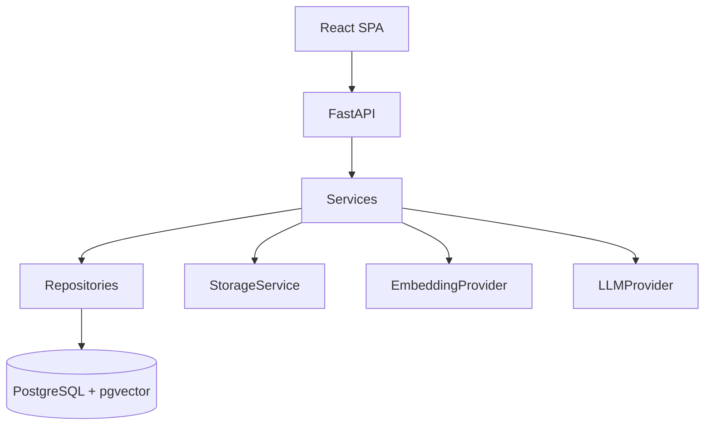
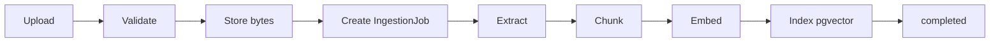

# Architecture overview

## System context

The Enterprise Knowledge Management Platform is a monorepo with:

- **backend/** — FastAPI API, SQLAlchemy, Alembic, ingestion/RAG modules
- **frontend/** — React + TypeScript + Vite SPA
- **PostgreSQL + pgvector** — primary datastore and vector index

## Backend layers

| Layer | Path | Role |
|-------|------|------|
| API | `app/api/v1` | HTTP routes, DI, status codes |
| Core | `app/core` | Settings, logging, middleware, exceptions |
| Database | `app/database` | Engine, sessions, Base |
| Models | `app/models` | ORM entities |
| Schemas | `app/schemas` | Pydantic I/O contracts |
| Repositories | `app/repositories` | Persistence queries |
| Services | `app/services` | Business use cases |
| Security | `app/security` | Passwords, JWT, RBAC |
| Domain packages | `ingestion`, `retrieval`, `llm`, `storage` | Replaceable integrations |

Route handlers stay thin: authorize → call a service → audit. Business logic does not live
in the router modules.

## Authentication

- **Passwords:** bcrypt (`app/security/passwords.py`)
- **Tokens:** HS256 JWTs (`sub`, `role`, `exp`, `type=access`)
- **RBAC:** `RequireAdmin` / `require_roles(...)`
- **Registration:** always `employee`; admins via `scripts/create_admin.sh` or `make seed`

## Document management

- **Models:** `Document`, `DocumentVersion`, `IngestionJob`
- **Storage:** `StorageService` protocol — `LocalStorageService` + optional `AzureBlobStorageService`
- **Validation:** extension, size, content-type, magic bytes
- **Access:** admins upload/delete/reprocess; authenticated users list/view

## Ingestion pipeline

- **Extract:** PDF (page-aware), DOCX, TXT
- **Chunk:** overlapping windows (`CHUNK_SIZE` / `CHUNK_OVERLAP`)
- **Embed:** `fake` or `together`
- **Jobs:** atomic claim `pending` → `running`; stages on the document; reprocess = new attempt
- **Execution:** FastAPI `BackgroundTasks` (inline when `APP_ENV=test`); stale recovery on startup

## Retrieval & RAG

- **Traditional search:** title / department / category / chunk keyword
- **Semantic search:** query embedding → pgvector cosine (`<=>`) + HNSW (SQLite tests use JSON cosine)
- **Grounded chat:** `Conversation` / `Message` / `Citation`
- **Safeguards:** `RETRIEVAL_MIN_SCORE` refusal when context is weak
- **Honesty:** grounding reduces unsupported answers; it does not eliminate hallucinations

## Frontend

- JWT in `localStorage` + `/auth/me`
- Documents, assistant (citations + filters), admin analytics, system status
- Shared feedback primitives: error banners, skeletons, toasts, confirm banners

## Production quality

- **AuditLog** for auth and document admin actions
- **Admin APIs:** analytics, ingestion jobs, audit logs, stale-job recover
- **Rate limiting:** in-process sliding window (Redis-ready)
- **`/ready`:** database, pgvector, storage, LLM/embedding (required vs degraded)
- **Ops docs:** security, operations, Azure plan

## Health vs readiness

- `GET /health` — liveness (`status`, `service`, `version`, `environment`)
- `GET /ready` — dependency checks; required failure → **503** `not_ready`; provider issues → **200** `degraded`

## Azure-ready notes

See [azure.md](azure.md) for Container Apps, Flexible Server + pgvector, Blob, Key Vault, and
Application Insights mapping. Local Compose remains the default developer path.
