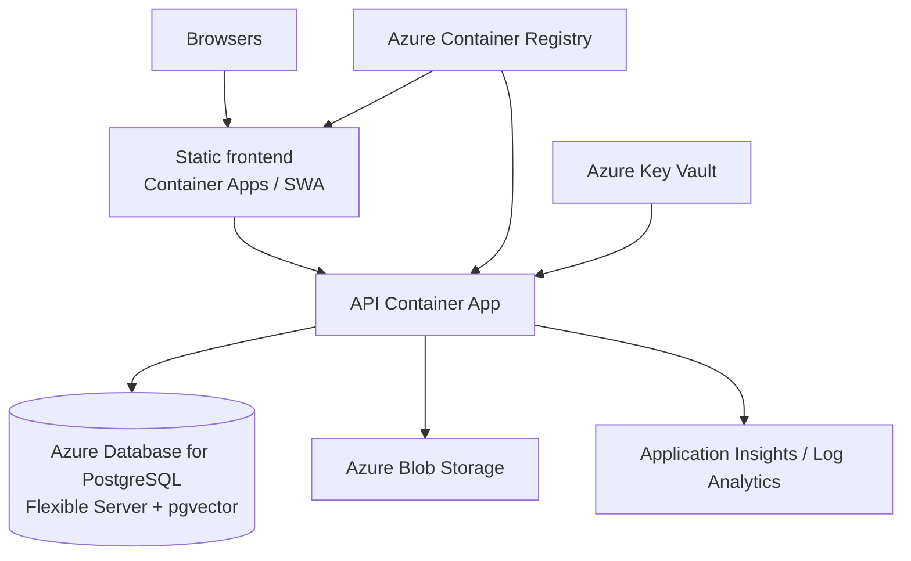

# Azure deployment plan

This portfolio app runs locally with Docker Compose and maps onto Azure without a rewrite.
**Do not provision paid resources unless you intend to operate and pay for them.**
This document and `infra/azure/` are a deployment path, not an auto-provisioning bot.

## Target topology



## Service mapping

| Concern | Local | Azure |
|---------|-------|--------|
| API process | Compose `api` / `make run` | **Azure Container Apps** (preferred) or App Service (Linux container) |
| Frontend | Vite dev / nginx image | Container Apps (static nginx) or **Static Web Apps** |
| Database | Postgres + pgvector | **Azure Database for PostgreSQL Flexible Server** + `CREATE EXTENSION vector` |
| Files | `STORAGE_BACKEND=local` | `STORAGE_BACKEND=azure` + Blob container |
| Images | local Docker build | **Azure Container Registry** |
| Secrets | `backend/.env` | **Key Vault** → Container Apps secret refs |
| Logs / metrics | stdout JSON (`LOG_FORMAT=json`) | **Application Insights** / Log Analytics (ingest container logs) |
| Rate limits | in-process | APIM or Redis-backed limiter (multi-replica) |

App Service remains a valid alternative if you prefer a single web app slot; Container Apps
fits migration jobs and future worker sidecars better.

## Environment variable mapping

| Variable | Production guidance |
|----------|---------------------|
| `APP_ENV` | `production` |
| `SECRET_KEY` | Key Vault secret, ≥32 random chars |
| `DATABASE_URL` | Flexible Server connection string (SSL) |
| `CORS_ORIGINS` | Exact frontend origin(s) |
| `STORAGE_BACKEND` | `azure` |
| `AZURE_STORAGE_CONNECTION_STRING` | Key Vault (or managed identity later) |
| `AZURE_STORAGE_CONTAINER` | e.g. `documents` |
| `LLM_PROVIDER` / `EMBEDDING_PROVIDER` | `together` for live RAG, else `fake` |
| `TOGETHER_API_KEY` | Key Vault |
| `LOG_FORMAT` | `json` |
| `APPLICATIONINSIGHTS_CONNECTION_STRING` | Optional; primary path is stdout → Log Analytics |
| `VITE_API_BASE_URL` | Public API HTTPS URL (build-time for static frontend) |

Install Azure SDK only when needed:

```bash
pip install -e ".[azure]"
```

## PostgreSQL + pgvector

1. Create Flexible Server (Burstable is enough for demos).
2. Allow the Container Apps egress / private networking as appropriate.
3. Connect and run:

```sql
CREATE EXTENSION IF NOT EXISTS vector;
```

4. Run migrations as an init job / one-shot container:

```bash
alembic upgrade head
```

The API image already contains Alembic; Compose runs upgrade on startup for local demos.

## Blob storage adapter

`AzureBlobStorageService` implements the same `StorageService` protocol as local disk:

- Creates the container if missing
- Rejects `..` path traversal in keys
- Surfaces clear errors when the optional `[azure]` extra or connection string is missing
- `/ready` probes container properties when `STORAGE_BACKEND=azure`

## Suggested rollout (manual)

1. Create a resource group and ACR; build/push `backend` + `frontend` images (CI already builds them).
2. Provision Flexible Server; enable `vector`; apply migrations.
3. Create a storage account + container; store the connection string in Key Vault.
4. Deploy API Container App with Key Vault references and probes:
   - Liveness: `GET /health`
   - Readiness: `GET /ready` (`degraded` is still HTTP 200)
5. Deploy frontend with `VITE_API_BASE_URL` pointing at the API hostname.
6. Wire Log Analytics / Application Insights to container logs (`request_id`, JSON fields).
7. Before multi-replica scale-out, move ingestion off in-process `BackgroundTasks` (see README).

Optional sketch files (not applied automatically):

- [`infra/azure/`](../infra/azure/README.md) — Bicep parameters + module outline
- [`docker-compose.prod.example.yml`](../docker-compose.prod.example.yml) — production-shaped local Compose

## Application Insights

Prefer **stdout JSON logs** (`LOG_FORMAT=json`) collected by the Container Apps / App Service
logging pipeline into Log Analytics. Correlate with `X-Request-ID` / `request_id`.

`APPLICATIONINSIGHTS_CONNECTION_STRING` is reserved for a future OpenTelemetry exporter; do not
treat it as required for a first cloud deploy.

## Cost control

- Use Container Apps consumption and stop non-prod apps when idle
- Burstable Postgres SKU for demos; delete resource groups after interviews if unused
- Keep `*_PROVIDER=fake` unless you need live Together.ai calls
- Do not leave public Postgres open to `0.0.0.0/0`

## Honest limitations

- Ingestion still runs in the API process until a queue worker is added
- In-memory rate limiting does not coordinate across replicas
- Managed identity (no connection string) is a follow-up; connection string via Key Vault is the documented v1 path
